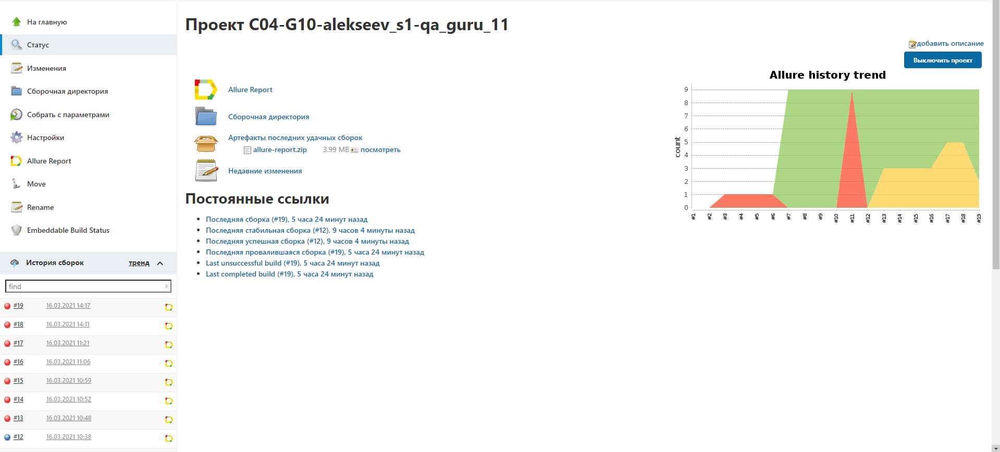

<h1>Проект с UI автотестами для сайта arenadata.tech</h1>
<h2>Стек используемых технологий:</h2>
<ul>
    <li>Java</li>
    <li>Selenide</li>
    <li>Junit5</li>
    <li>Allure</li>
    <li>Jenkins</li>
    <li>Selenoid</li>
    <li>Integration with telegram</li>
</ul>
<h2>Запуск тестов:</h2>
Запуск тестов можно выполнять как локально, так и в Jenkins.
При запуске используются параметры (опционально):
<ul>
    <li>-Dbrowser=</li>
    <li>-Dvideo.storage=</li>
    <li>-Dweb.remote.driver=</li>
</ul>
<h2>Пример используемых технологий:</h2>
Запуск тестов в Jenkins

